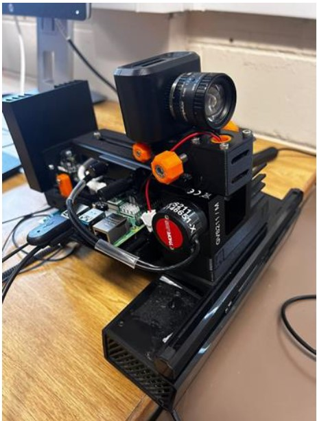
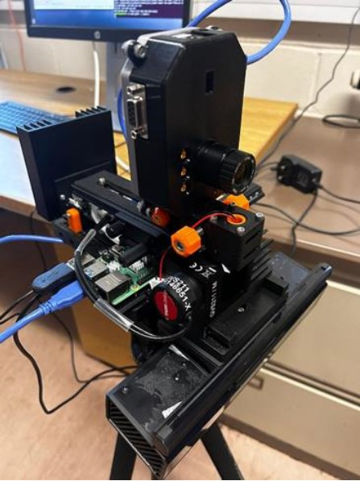
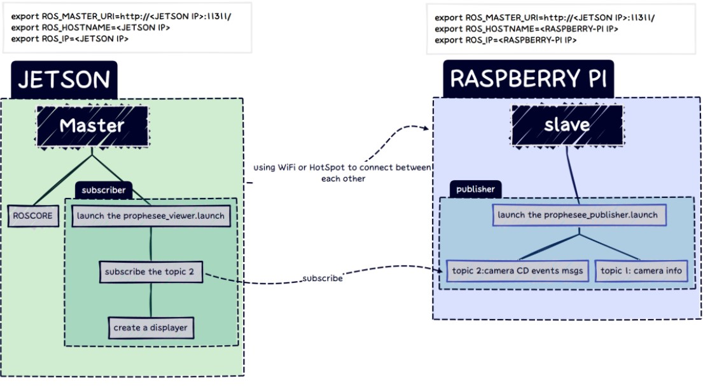

# Wireless-Event_camera
This Project entails the design of a Wireless Event Camera. 
## Disclaimer
This project is built using source code gotten from
[Prophesee Ros Wrapper Repository](https://github.com/prophesee-ai/prophesee_ros_wrapper) and guide from [Prophesee Documentation](https://docs.prophesee.ai/stable/index.html)
## Video Demo :
## Initial Stage 

## Final Stage

## About Event Camera
An event camera, also known as a dynamic vision sensor (DVS), is a type of neuromorphic sensor that captures visual information asynchronously and with extremely high temporal resolution. Unlike traditional cameras, which capture frames at fixed intervals, event cameras only record changes in brightness, generating a stream of events when significant changes occur. This design allows them to respond quickly to motion and changes in lighting conditions, making them ideal for tasks like robotics, autonomous vehicles, and high-speed tracking. Event cameras offer low latency and high dynamic range compared to conventional cameras.
The event Cameras used for the project are the Prophesee EVK3 and EVK4 which can be found at [Prohesee.ai](https://www.prophesee.ai/event-based-evaluation-kits/) 

### Project Objectives
1. Design a Real-time Image pipeline processing  for event camera
2. Establish real time wireless transmission of event frames from a event camera to a remote workstation
3. Design a 3D Mount for the event camera
4. Integrate the Event Camera on ROS.

### Hard Ware 
1. Raspberry Pi 4
2. Nvidia Jetson Tx
3. EVK3 / EVK4

### Software dependencis
1. ROS Melodic
2. Ubuntu 18.04

# 3D Mount for Camera

## CAD Design

 

## Physical Prototype

## Wireless Communication and ROS Integration

